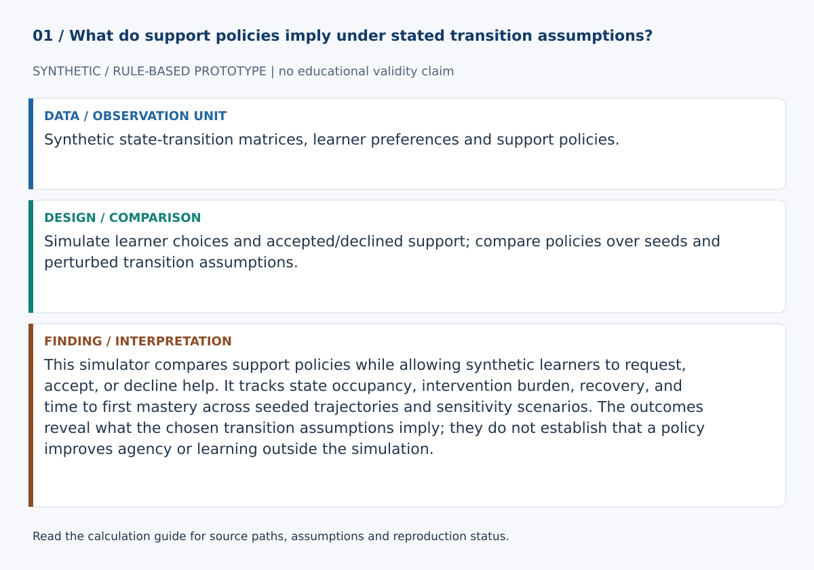
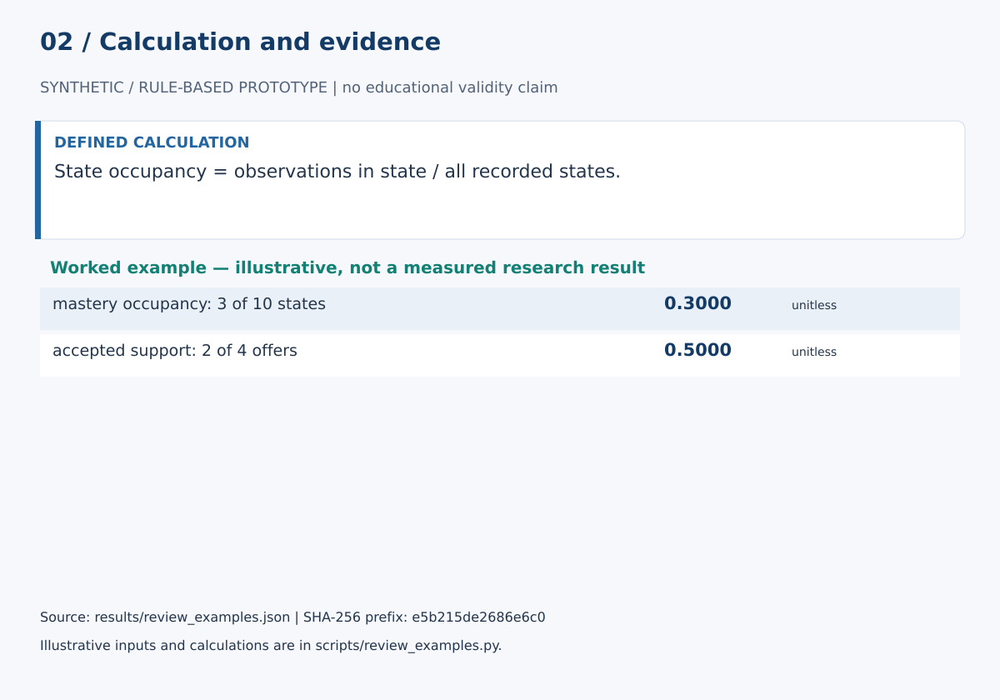

# Learner Agency Simulator

This simulator compares support policies while allowing synthetic learners to request, accept, or decline help. It tracks state occupancy, intervention burden, recovery, and time to first mastery across seeded trajectories and sensitivity scenarios. The outcomes reveal what the chosen transition assumptions imply; they do not establish that a policy improves agency or learning outside the simulation.

## Start here

- [Calculations, evidence and verification scope](CALCULATIONS.md)
- [Figure sources and exact numerical paths](docs/figure_spec.json)
- [Data status](data/README.md)





**Review scope:** 33 existing unittest checks passed. The bundled demonstration executed successfully in this review.

## Detailed project documentation

> Transparent learner-system interaction simulator for stress-testing agency-aware adaptive-support policies.

[](https://github.com/devissaputra/learner_agency_simulator/actions/workflows/ci.yml)


**Area:** AI in Education (AIEd) · Learner Agency & Adaptive Learning  
**Status:** working research prototype  
**Author:** Devis Saputra

## What this project is for

Adaptive systems are difficult to test safely when every policy change requires a live learner study.

This repository provides a synthetic learner-system environment for examining how **learner choices** interact with **adaptive support policies** before those policies are considered for real-user testing.

The current simulator does not define agency as a hidden psychological score. It operationalizes a narrower, inspectable idea: a simulated learner can request support, refuse support, persist, pause, change strategy, or change task challenge.

The result is not a digital twin of a learner. It is a transparent stress-test environment.

## Research questions

1. How do learner choices change the behavior of adaptive support policies?
2. How do proactive interventions compare with learner-requested help?
3. Which policies recover difficult trajectories without excessive support?
4. How much do policy conclusions depend on assumptions about help seeking, persistence, support acceptance, strategy switching, challenge preference, or autonomy preference?
5. Which policy conclusions survive changes in confusion and disengagement persistence?

## Learner-system interaction model


Each simulation step keeps three concepts separate:

1. current learner state
2. learner action
3. system action

The learner chooses an action from a probability distribution determined by the current state and synthetic agency parameters.

The system policy independently chooses whether to offer support.

The learner may accept the offer, refuse it, or request support even when the system offers nothing.

The resolved learner-system interaction then changes the next-state distribution.

## Synthetic learner states

The current task-state space contains:

- `mastery`
- `productive_struggle`
- `confusion`
- `disengagement`

Unlike the original prototype, every state has a distinct baseline transition pattern.

These labels are simulation abstractions. They are not inferred diagnoses.

## Learner actions

The current learner action space is:

- `continue`
- `request_hint`
- `request_example`
- `change_strategy`
- `choose_easier_task`
- `choose_harder_task`
- `pause`
- `decline_support`

This action layer is the repository's current operationalization of agency.

A real theory of student agency is much broader.

## System actions

The current adaptive system can offer:

- `none`
- `guided_hint`
- `worked_example`
- `reflection_prompt`
- `challenge`

Learner requests can trigger hints or examples even when the policy did not proactively offer them.

A learner can explicitly refuse unsolicited support.

## Synthetic agency profile

The simulator exposes six scenario parameters:

- help-seeking tendency
- support acceptance
- persistence
- challenge preference
- strategy switching
- autonomy preference

Each parameter is bounded from 0 to 1.

They change action probabilities. They must not be interpreted as psychological assessments or stable traits of real learners.

`data/sample.csv` includes several synthetic profiles for scenario testing.

## Transition model

`BASE_TRANSITIONS` defines a complete four-state transition matrix.

Before simulation, the code verifies:

- every state is present
- every row contains every possible next state
- probabilities are numeric and finite
- probabilities lie between 0 and 1
- every row sums to 1

Learner action and resolved system support then modify the valid baseline distribution.

## Included policies

The repository includes four transparent policy examples.

| Policy | Behavior |
|---|---|
| No support | never proactively intervenes |
| Confusion hint | offers a guided hint when the current state is confusion |
| Disengagement hint | offers a guided hint when the current state is disengagement |
| Autonomy-preserving | offers a reflection prompt when disengagement occurs and otherwise leaves initiative with the learner |

These are research controls, not recommended instructional policies.

## Policy stress testing

`evaluate_policy()` runs the same policy across many deterministic seeds.

`compare_policies()` applies the same simulation configuration to several named policies.

Current aggregate metrics include:

- mastery occupancy
- productive-struggle occupancy
- confusion occupancy
- disengagement occupancy
- fraction of runs that reach mastery
- mean time to first mastery
- proactive intervention count
- learner-requested support
- accepted support
- declined support
- disengagement recovery rate

This makes **policy stress testing an implemented feature**, not just a README claim.

## Simulator sensitivity

`perturb_transition_matrix()` changes confusion or disengagement persistence while preserving a valid transition matrix.

`sensitivity_study()` reruns policy comparisons under:

- baseline dynamics
- stickier disengagement
- stickier confusion
- more recoverable difficult states

The important question is not which policy "wins."

The useful question is:

> Does a policy conclusion survive plausible changes in the assumptions that generated it?

## Reproducibility

Each trajectory uses one persistent seeded random stream.

Multi-run policy evaluation uses deterministic seed sequences.

Running the same configuration again therefore returns the same simulated trajectories and aggregate results.

## Synthetic demo


The bundled demo performs three tasks:

1. prints one eight-step learner-system trajectory
2. compares four policies across 200 runs of 30 steps
3. repeats policy comparison under several altered transition scenarios

All outputs are synthetic simulator behavior.

They are **not** empirical results about real learners or evidence that one educational intervention is better than another.

## Data

The repository contains no human-subject dataset.

`data/sample.csv` contains synthetic parameter profiles only.

`data/README.md` documents the profile fields, state/action semantics, transition assumptions, empirical-calibration requirements, and data-governance boundary.

## Run the demo

```bash
git clone https://github.com/devissaputra/learner_agency_simulator.git
cd learner_agency_simulator
python scripts/run_demo.py
python -m unittest discover -s tests -v
```

The current baseline uses only the Python standard library.

## Core API

`validate_transition_matrix(...)` validates complete stochastic state dynamics.

`validate_agency_profile(...)` validates synthetic agency parameters.

`learner_action_probabilities(...)` exposes the action distribution used by the simulator.

`choose_learner_action(...)` samples one learner choice.

`resolve_support(...)` combines learner requests/refusal with the system offer.

`transition_probabilities(...)` applies learner-action and support effects to the current state.

`simulate(...)` records the full learner-system trajectory.

`trajectory_metrics(...)` summarizes one simulated run.

`evaluate_policy(...)` aggregates one policy across many seeds.

`compare_policies(...)` compares named policies under identical simulation assumptions.

`perturb_transition_matrix(...)` creates valid alternative simulator dynamics.

`sensitivity_study(...)` reruns policy comparison across transition scenarios.

## Evaluation view


The graphic identifies evidence a real simulator study should collect.

Its bars are illustrative only. They are not measured model-performance scores.

## Conceptual grounding

The repository is informed by student-agency and self-regulated-learning literature, while deliberately implementing only a narrow simulation subset.

The OECD Learning Compass frames student agency around learners shaping their own direction rather than only receiving fixed instructions.

Self-regulated-learning research similarly emphasizes active cognitive, metacognitive, motivational, and behavioral regulation.

See `docs/related_work.md` for references and the boundary between those theories and this implementation.

## Limits and responsible use

The current simulator does **not**:

- measure learner agency
- infer psychological states
- model knowledge components
- validate self-regulation constructs
- represent peer or teacher co-agency
- learn transition probabilities from data
- estimate real treatment effects
- optimize policies with reinforcement learning
- prove that simulated policy differences transfer to real education

A policy can perform well by exploiting unrealistic simulator assumptions.

That is why sensitivity testing is part of the baseline.

See `docs/ethics_and_risks.md` before connecting the simulator to real learner data or real adaptive interventions.

## Repository map

```text
.
├── .github/workflows/ci.yml
├── assets/
│   ├── architecture.svg
│   ├── data_flow.svg
│   ├── demo_snapshot.svg
│   └── evaluation_dashboard.svg
├── data/
│   ├── README.md
│   └── sample.csv
├── docs/
│   ├── ethics_and_risks.md
│   ├── related_work.md
│   └── research_protocol.md
├── reports/model_card.md
├── scripts/run_demo.py
├── src/learner_agency_simulator/core.py
├── tests/test_core.py
├── .gitignore
├── CITATION.cff
├── LICENSE
├── pyproject.toml
└── README.md
```

## Research path

A stronger empirical version would:

1. define observable state and learner-action constructs
2. calibrate transition ranges from an appropriate dataset
3. quantify uncertainty in the calibrated simulator
4. validate trajectories on held-out learner traces
5. test several synthetic agency profiles rather than one average profile
6. report policy rank reversals across simulator assumptions
7. add content/skill difficulty and longer-term goal structure
8. model co-agency with teachers, peers, or AI support
9. compare simulator-based predictions with controlled real-user studies

## Citation and license

`CITATION.cff` contains the software citation. Code and original SVG visuals use the MIT License. External datasets retain their own licenses and governance requirements.
