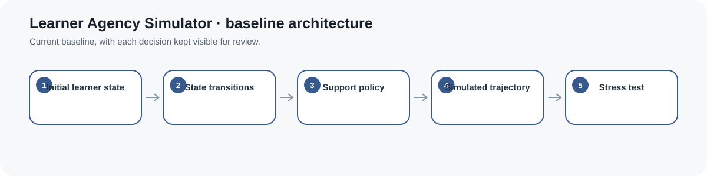
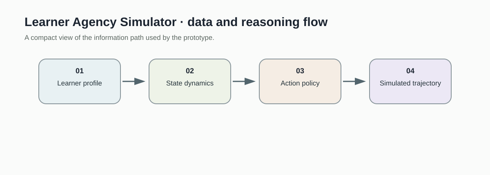
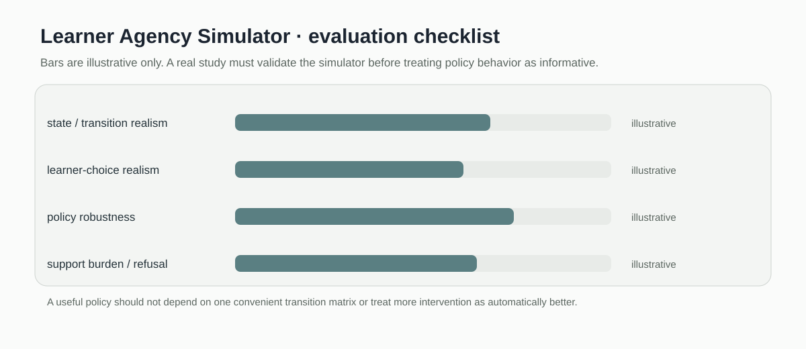

# Learner Agency Simulator

> Controllable stochastic learner state simulator for stress testing adaptive support policies.

[](https://github.com/devissaputra/learner-agency-simulator/actions/workflows/ci.yml)



**Area:** Responsible & Human-Centered AIED    
**Status:** working research prototype  
**Author:** Devis Wawan Saputra

## What this project is for

Adaptive systems are difficult to test safely when every policy change requires a live learner study. This simulator creates controllable learner-state trajectories so support policies can be stress-tested before they reach real people.

**Who may find it useful:** Researchers developing adaptive learning policies, learner models, and simulation-based AIED experiments.

## Research questions

1. How do adaptive policies behave under diverse learner-state trajectories?
2. Which policies recover disengaged learners without over-supporting?
3. How sensitive are policy results to simulator assumptions?

## How it works

The simulator uses named learner states and explicit transition probabilities. A guided hint changes the transition distribution for disengagement, while other states follow their own baseline dynamics. A single seeded random stream makes complete trajectories reproducible.



A starting state enters the transition policy, an optional support action changes the applicable probabilities, and the simulator records the resulting trajectory. The states are synthetic abstractions, not inferred psychological labels.


This snapshot shows the bundled synthetic example for Learner Agency Simulator. It checks the software path; it is not an empirical performance result.

## Methods in the current baseline

- explicit learner states
- state transition probabilities
- support conditioned transitions
- reproducible simulation
- policy stress testing

## Data

Simulation only; no human-subject data are included.

`data/README.md` documents the sample schema and the conditions that should be recorded before any real dataset is connected. Restricted or identifiable learner data should stay outside the repository.

## Run the demo

```bash
git clone https://github.com/devissaputra/learner-agency-simulator.git
cd learner-agency-simulator
python scripts/run_demo.py
python -m unittest discover -s tests -v
```

The demo prints one seeded eight step trajectory. Running it again with the same seed returns the same sequence, which makes policy comparisons reproducible.

## What to evaluate next

The most useful next step is not more states. It is to fit or calibrate transition assumptions from empirical traces, then test whether candidate tutoring policies remain safe under plausible learner behavior variation.

## Evaluation view



The Learner Agency Simulator dashboard is an evaluation checklist rather than a result chart. The bars are illustrative only; the labels show the evidence a real study would need to collect.

## Limits and responsible use

The state names and transition probabilities are modeling assumptions. They should never be interpreted as validated psychological states or individual diagnoses. See `docs/ethics_and_risks.md` for the broader risk review.

## Repository map

```text
.
├── .github/workflows/ci.yml
├── assets/
│   ├── architecture.svg
│   ├── data_flow.svg
│   ├── demo_snapshot.svg
│   └── evaluation_dashboard.svg
├── data/
│   ├── README.md
│   └── sample.csv
├── docs/
│   ├── ethics_and_risks.md
│   ├── related_work.md
│   └── research_protocol.md
├── reports/model_card.md
├── scripts/run_demo.py
├── src/learner_agency_simulator/core.py
├── tests/test_core.py
├── CITATION.cff
├── LICENSE
├── pyproject.toml
└── README.md
```

## Research path

A credible next version would:

1. estimate transition ranges from an appropriate empirical dataset
2. stress test at least two support policies across many seeds
3. report which conclusions change when transition assumptions are perturbed

## Related work

`docs/related_work.md` points to open projects that are relevant to this problem area. They are context for comparison and study design; this repository does not present their code as its own.

## Citation and license

`CITATION.cff` contains the software citation. The code and original SVG visuals use the MIT License. Any external dataset keeps its own license and usage conditions.
